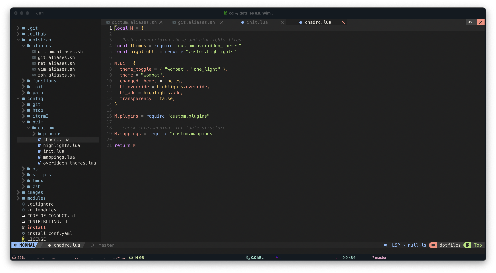

# Dotfiles

[](https://github.com/fisenkodv/dotfiles/actions)

**Warning**: Don’t blindly use my settings unless you know what that entails. Use at your own risk!

## Vim setup

Requires [Neovim](https://neovim.io/) (>= 0.8)

- [NvChad](https://github.com/NvChad/NvChad) - Blazing fast Neovim config providing solid defaults and a beautiful UI
  - [JetBrains Nerd Font](https://www.nerdfonts.com/font-downloads)

## Shell setup (macOS)

- [Dotbot](https://github.com/anishathalye/dotbot) - a tool that bootstraps dotfiles
- [Oh My Zsh](https://github.com/robbyrussell/oh-my-zsh) - framework for managing `zsh` configuration
- [Powerlevel10k](https://github.com/romkatv/powerlevel10k) - theme
  - [Meslo Nerd Font](https://github.com/romkatv/powerlevel10k#meslo-nerd-font-patched-for-powerlevel10k) Meslo Nerd Font patched for Powerlevel10k

### Installation

```bash
git clone git@github.com:fisenkodv/dotfiles.git .dotfiles --recursive
cd .dotfiles
make install
```

### Inspired By

- https://github.com/denolfe/dotfiles
- https://github.com/craftzdog/dotfiles-public

## License

MIT
