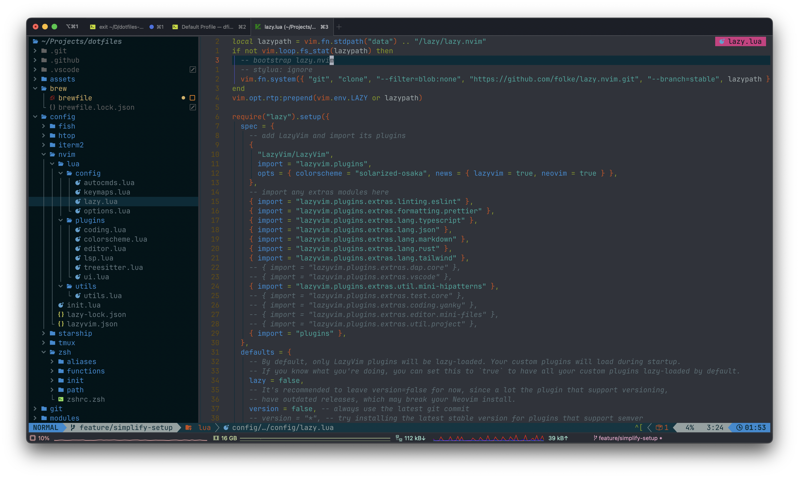

# Dotfiles

[](https://github.com/fisenkodv/dotfiles/actions/workflows/test_install.yaml)
[](https://github.com/fisenkodv/dotfiles/actions/workflows/update_submodules.yml)

**Warning**: Don’t blindly use my settings unless you know what that entails. Use at your own risk!

## Neovim setup

### Requirements

- Neovim >= **0.9.0** (needs to be built with **LuaJIT**)
- Git >= **2.19.0** (for partial clones support)
- [LazyVim](https://www.lazyvim.org/)
- a [Nerd Font](https://www.nerdfonts.com/)(v3.0 or greater) **_(optional, but needed to display some icons)_**
  - [JetBrains Nerd Font](https://www.nerdfonts.com/font-downloads)
- [lazygit](https://github.com/jesseduffield/lazygit) **_(optional)_**
  - **live grep**: [ripgrep](https://github.com/BurntSushi/ripgrep)
  - **find files**: [fd](https://github.com/sharkdp/fd)
- **tmux** (optional)
  - [tpm](https://github.com/tmux-plugins/tpm) - Tmux Plugin Manager
- [Solarized Osaka](https://github.com/craftzdog/solarized-osaka.nvim)

## Shell setup (macOS)

- [Homebrew](https://brew.sh)
- [asdf](https://asdf-vm.com/)

## Installation

```bash
git clone git@github.com:fisenkodv/dotfiles.git .dotfiles --recursive
cd .dotfiles
make install
```

## Inspired By

- https://github.com/denolfe/dotfiles
- https://github.com/craftzdog/dotfiles-public

## License

[MIT](LICENSE)
